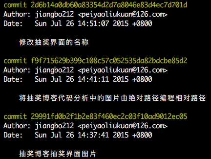
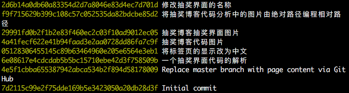
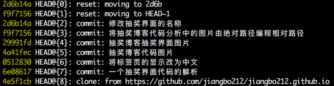

git命令的学习

1. git add
   
   增加一个文件到git仓库的暂存区。
   
   示例：
   
   ``` shell
   git add REMADE.md
   ```
   
   把文件REMADE.md提交到本地仓库的暂存区。
   
2. git commit
   
   把暂存区的文件提交到本地仓库中。
   
   示例：
   
   ``` shell
   git commit -m "日志"
   ```
   
   把本地仓库暂存区中的修改提交到本地仓库中,参数m值得是修改日志，每次从暂存区提交修改到本地仓库都要有日志。
   
3. git diff
   
   查看文件修改前与修改后的区别。
   
   ``` shell
   git diff <file>
   ```
   
   查看文件file修改前与修改后的不同点。
   
4. git checkout
   
   可以将工作区文件的修改回撤;切换分支
   
   ``` shell
   git checkout -- <file>
   ```
   
   把工作区的文件file之前的修改回撤。
   
   ``` shell
   git checkout dev
   ```
   
   从当前工作分支切换到分支dev
   
   ``` 
   git checkout -b dev
   ```
   
   新建分支dev，并切换到分支dev
   
5. git status
   
   查看本地git仓库现在的状态，包括工作区是否有文件被修改，暂存区是否有文件。
   
   ``` shell
   git status
   ```
   
   查看所在git仓库是否有变化。
   
6. git reset
   
   将本地仓库暂存区的修改回撤或将本地仓库回撤
   
   ``` shell
   git reset --hard HEAD~1
   ```
   
   将本地仓库回撤到前一个状态，如1变成2，则是撤回到当前状态前的第二个状态
   
   ``` shell
   git reset --hard "状态版本号"
   ```
   
   将本地仓库回撤至指定版本号的状态
   
   ``` shell
   git reset HEAD REMADE.md
   ```
   
   将暂存区的REMADE.md文件的修改回撤到工作区
   
7. git log
   
   查看本地仓库的版本记录
   
   ``` shell
   git log
   ```
   
   输出如下图
   
   ``` shell
   git log --pretty=oneline
   ```
   
   输出如下图
   
   两种输出内容并无不同，只是在排版上第二种更易看。
   
8. git reflog
   
   显示本地仓库的提交记录
   
   ``` shell
   git reflog
   ```
   
   如下图：
   
9. git rm
   
   删除暂存区内的文件
   
   ``` shell
   git rm <file>
   ```
   
10. git push
    
    将本地仓库推送到远程仓库去
    
    ``` shell
    git push origin master
    ```
    
11. git branch
    
    查看本地仓库的分支
    
    ``` shell
    git branch
    ```
    
    输出所有的本地仓库分支，前带*号的表示是当前仓库
    
    ``` shell
    git branch dev
    ```
    
    新建分支dev
    
    ``` shell
    git branch -d dev
    ```
    
    删除分支dev
    
12. git merge
    
    将指定分支合并到当前分支
    
    ``` shell
    git merge dev
    ```
    
    将分支dev合并到当前分支
    
13. 随碟附
    
    ``` shell
    git push origin master
    ```